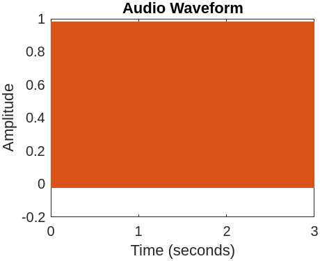
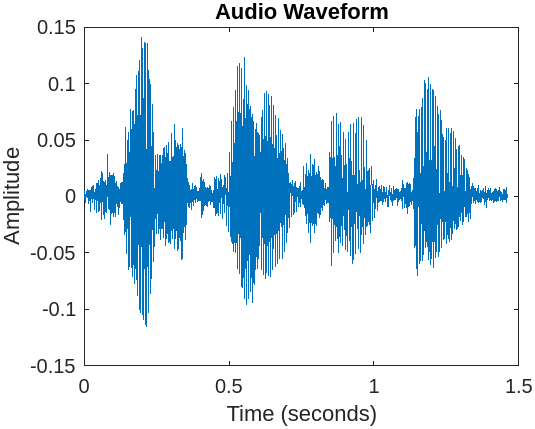

    Process two short audio files of your choice and verify your results by running the effect in MATLAB (or Python) and 
    computing the difference between outputs. Add the plots to a new file assignment1.md in your repository.

Here are the plots two different wav files after I applied the filter to them in MatLab. The first one is the sweep.wav that we used for Assignment 1. The second one is a wav I created in Audacity called voice.wav.

 
 
I applied an IIR to the sweep.wav with a delay of 10 and an FIR to the voice.wav with a delay of 10. Both have a gain of .5.

As of right now, I can not compare the two outputs with my program's output because I can not get the input to cooperate.
